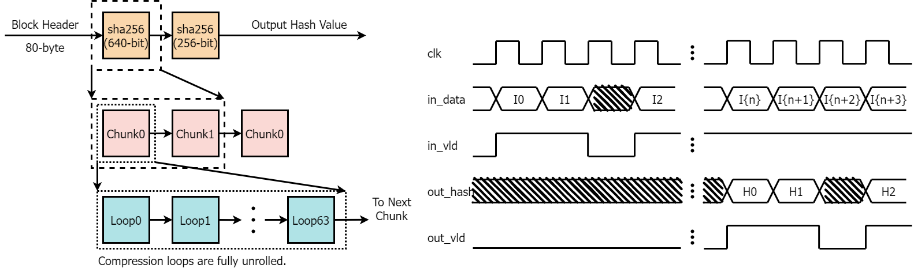
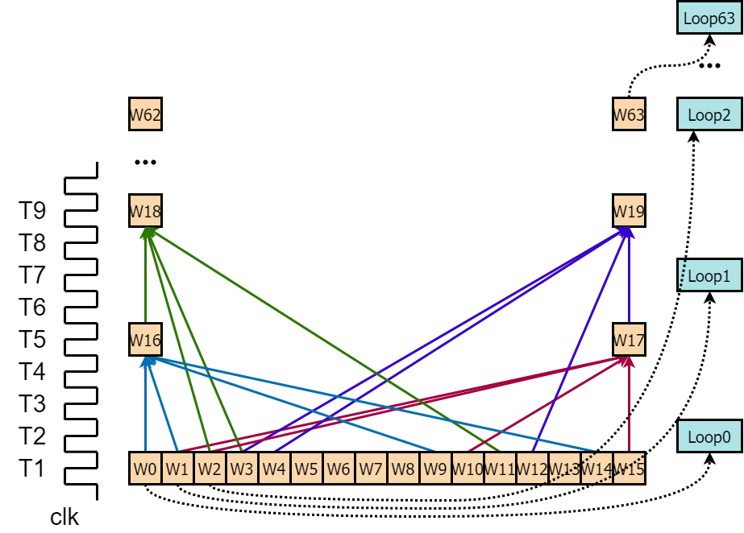
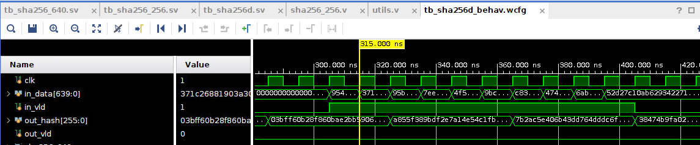
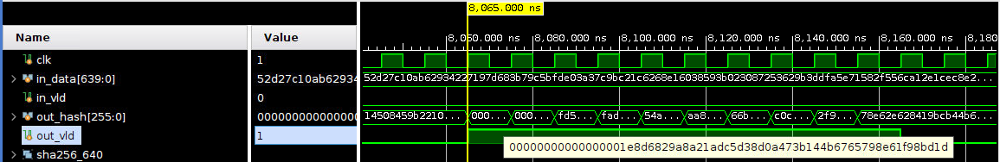

# Block Hashing Algorithm (Verilog Implementation)
## Files
```
.
│  .gitignore
│  readme.md
├─hdl                    // Sources code
│  ├─py                  // Software implementation of sha256 alrogithm
│  │      bitcoin.py
│  │      gen.py
│  │      main.py
│  ├─src                // Source code of hardware
│  │      compress.v    // Main loop of compression
│  │      incl.vh       // Macros
│  │      sha256.v      // Chunk processing
│  │      sha256d.v     // Implementation of sha256(sha256(in_adta))
│  │      sha256_256.v  // The second stage of sha256d
│  │      sha256_640.v  // The first stage of sha256d
│  │      utils.v       // utils
│  │      w.v           // The processing of w 
│  └─tb
│          alg.sv            // Implementation of sha256
│          tb_sha256.sv      // Test bench of sha256
│          tb_sha256d.sv     // Test bench of sha256d
│          tb_sha256_256.sv  // Test bench of sha256_256
│          tb_sha256_640.sv  // Test bench of sha256_640
└─
```
## Hardware Architecture

The module `sha256d` in [sha256d.v](./hdl/src/sha256d.v) implements the Block Hashing Algorithm, which takes 80-byte block header as input and performs sha256 twice to generate the 256-bit hash result. It is fully pipelined and thus has the ability to accept input in every clock cycle. The ports are described as follows:
```
input clk               -> Clock.
input [639:0] in_data   -> The 80-byte block header.
input in_vld            -> It indicates whether the header is valid.
output [255:0] out_hash -> The 256-bit hash result
output out_vld          -> It indicates whether the output is valid.
```
An instance of `sha256d` consists of an instance of `sha256_640` and an instance of  `sha256_256`, which correspond to the first and second sha256 stages, respectively. 

## Chunk processing

There are 64 loops in the processing of a chunk. The 32-bit w should be ready before the loop starts. The first 16 ws just copy the chunk and thus can be prepared in the first clock cycle. The values of w16 and w17 respectively depend on w15 and w16 and can be calculated in next stage. The calculation of w takes 3 cycles to achieve maximum clock frequency, so w16 and w17 are ready at T5. The processing of a loop is divided into 4 cycles. The total length of the pipeline is 4*64=256.

## Simulation
The first two examples are the header of [Block 125552](https://www.blockchain.com/btc/block/125552) and [Block 277316](https://www.blockchain.com/btc/block/277316), respectively.

